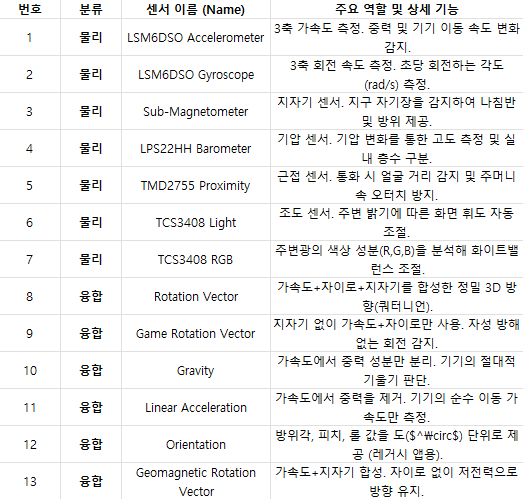
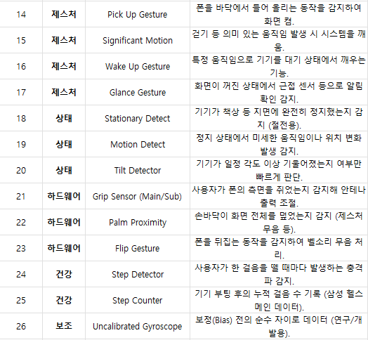
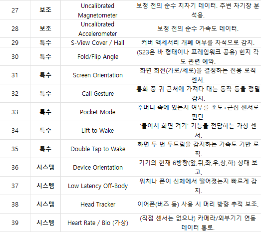

# 1/15

# 서론

본 프로젝트의 주된 목적은 지진이나 전시 상황 등으로 인해 건물이 붕괴되어 그 안에 갇힌 요구조자가 구조자에게 자신의 위치 신호를 전달함으로써, 보다 신속한 구조를 받을 수 있도록 하는 데 있다.

우리는 다양한 비상 상황을 가정하였으며, 구조 성공률을 높이기 위해 특정 상황에서 자동으로 실행되는 기능이 필요하다고 판단하였다. 이에 따라 안드로이드 기반 모바일 기기의 센서 값을 활용하여 기능이 자동으로 실행되도록 구현하고자 하였고, 이것이 본 학습을 진행하게 된 계기가 되었다.

# Android SDK Platform-Tools

우리는 안드로이드 기반 갤럭시 모델에 본 프로젝트를 적용하기로 결정하였으며, 자동 실행 판단 기능을 구현하기 위해 우선적으로 기기에 탑재된 센서들을 파악할 필요가 있었다. 이에 공식 안드로이드 개발자 지원 사이트에서 센서 및 센서 데이터 목록을 호출할 수 있는 Android SDK Platform-Tools를 확인하고 이를 활용하였다.

- https://developer.android.com/tools/releases/platform-tools?hl=ko

## 센서 정보 수집 방법

1. Android SDK Platform-Tools를 다운로드한 후 압축을 해제하고, 해당 파일 경로에서 CMD(터미널)를 실행한다.

2. PC와 모바일 기기를 USB로 연결한다.

3. ADB(Android Debug Bridge) 명령어를 입력하여 센서 정보를 호출한다.

    `adb shell dumpsys sensorservice`

## 센서 수집 결과
갤럭시S23 기준 기기에 탑재된 센서의 개수와 종류, 각 센서의 데이터가 출력되고 이를 정리하였다.

# 결론
건물 붕괴 상황에서는 큰 흔들림이 동반될 가능성이 높다고 판단하여 **가속도 센서**, **전자기 센서**, **자이로 센서** 데이터를 주요 분석 대상으로 선정하였다. 또한 구조 대상자가 건물 잔해에 갇힐 경우 외부 빛이 차단될 수 있다는 점을 고려하여 **조도 센서** 데이터 역시 중요한 판단 요소로 결정하였다.