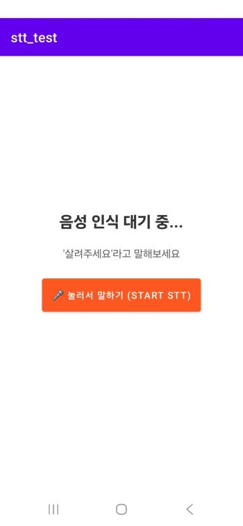
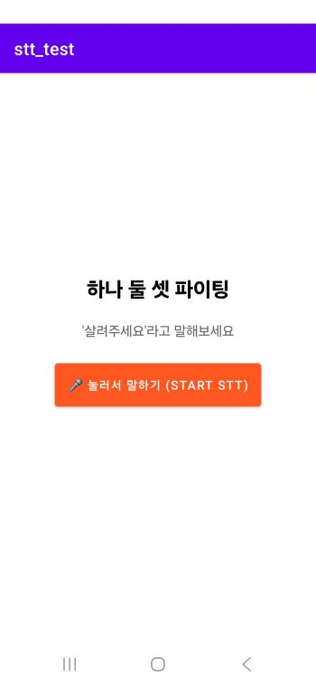

# 1/15

# 서론

본 프로젝트는 복합적인 센서 데이터를 활용하여 비상 상황에서 자동으로 실행되는 기능을 구현하는 것을 목표로 한다. 그러나 자동 실행 방식은 비상 상황이 아님에도 불구하고 오작동할 경우, 사용자에게 불필요한 혼란이나 위험을 초래할 수 있다는 한계를 지닌다.

이러한 문제를 해결하기 위해 단순한 센서 기반 판단만으로는 충분하지 않다고 판단하였으며, 자동 실행 여부를 보다 신중하게 결정할 수 있는 추가적인 안전 장치가 필요하다는 결론에 이르렀다. 이에 따라 본 프로젝트에서는 자동 실행 과정에 사용자의 상태를 한 번 더 확인할 수 있는 보조적인 판단 방식의 필요성을 인식하게 되었다.

# 본론

자동 실행의 신뢰성을 높이기 위한 보조 판단 방식으로, 우리는 사용자의 음성을 인식할 수 있는 STT(Speech To Text) 기술을 활용하고자 하였다. 이를 통해 센서 데이터로 1차 판단이 이루어진 이후, 사용자에게 현재 상황이 비상 상황인지 여부를 직접 확인하는 구조를 구상하였다. 만약 사용자가 비상 상황임을 언급하거나, 의식 불명 등으로 인해 응답이 불가능한 경우에는 자동 실행이 이루어지도록 설계하였다.

이러한 기능 구현을 위해 여러 STT 기술을 조사하였으며, 그 과정에서 Vosk, Whisper 등 다양한 후보 기술을 검토하게 되었다. 다만 본 프로젝트는 저전력 환경에서도 동작해야 하고, 인터넷 연결이 불가능한 상황 또한 고려해야 했기 때문에 온 디바이스(On-device) 방식의 STT 기술이 필수적이었다. 이에 따라 우선적으로 **Android Native Speech-to-Text(STT) API**를 활용한 테스트 애플리케이션을 구현하여, 해당 방식의 실효성을 검증해 보고자 하였다.

## 구현

# 결론
현재 테스트 애플리케이션은 음성 인식 정확도 측면에서는 만족스러운 결과를 보였으나, 현재까지는 네트워크 연결이 필요한 방식으로만 동작하고 있다. 다만 Android Native STT API가 온 디바이스 처리를 지원할 가능성도 존재하므로, 해당 기능을 실제로 활용할 수 있는지에 대해서는 추후 추가적인 학습과 실험이 필요하다고 느꼈다.